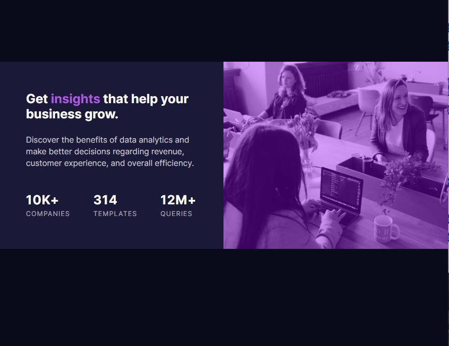
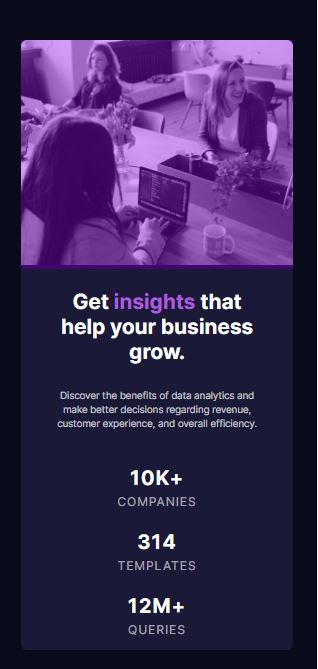

# stats-preview-card-component
# Frontend Mentor - Stats preview card component solution

This is a solution to the [Stats preview card component challenge on Frontend Mentor](https://www.frontendmentor.io/challenges/stats-preview-card-component-8JqbgoU62). Frontend Mentor challenges help you improve your coding skills by building realistic projects. 

## Table of contents

- [Overview](#overview)
  - [The challenge](#the-challenge)
  - [Screenshot](#screenshot)
  - [Links](#links)
  - [Built with](#built-with)
  - [What I learned](#what-i-learned)
  - [Continued development](#continued-development)
- [Author](#author)

## Overview

### The challenge

Users should be able to:

- View the optimal layout depending on their device's screen size

### Screenshot
<b>Desktop Version</b>
 

 
<b>Tab Version</b>
 

 
<b>Mobile Version</b>
 

### Links

- Solution URL: [https://github.com/shivani-1111/stats-preview-card-component]
- Live Site URL: [https://shivani-1111.github.io/stats-preview-card-component/]

### Built with

- Semantic HTML5 markup
- CSS custom properties
- Flexbox
- CSS Grid
- Mobile-first workflow
- For styles

### What I learned

I learned flexbox and SASS. This project is completely made on flexbox and sass.

### Continued development

In my future projects i'll keep using flexfox and sass untill i am excellent in this. 
Next goal would be making project on react.

## Author

- Website - [SHIVANI](https://shivani-1111.github.io/stats-preview-card-component/)
- Frontend Mentor - [@shivani-1111](https://www.frontendmentor.io/profile/shivani-1111)

